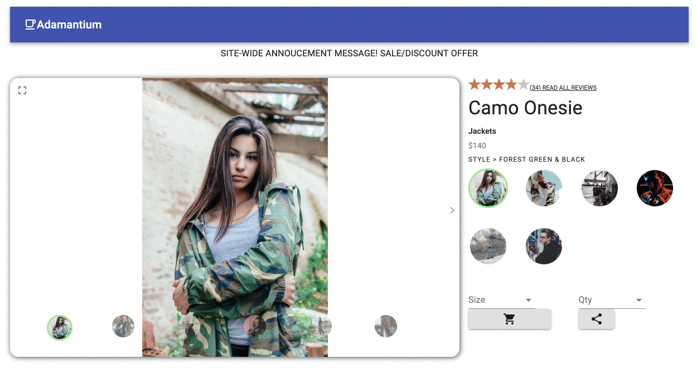
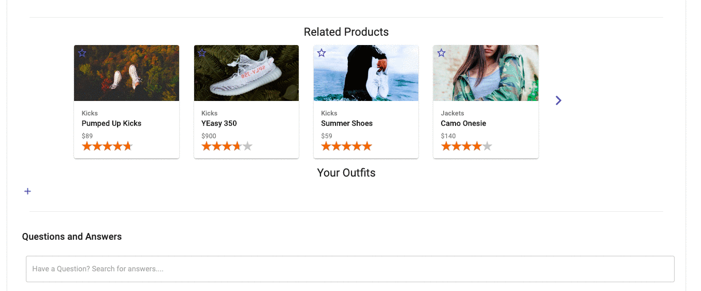
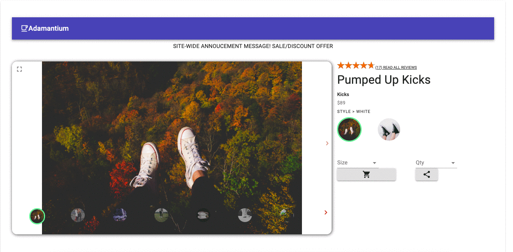
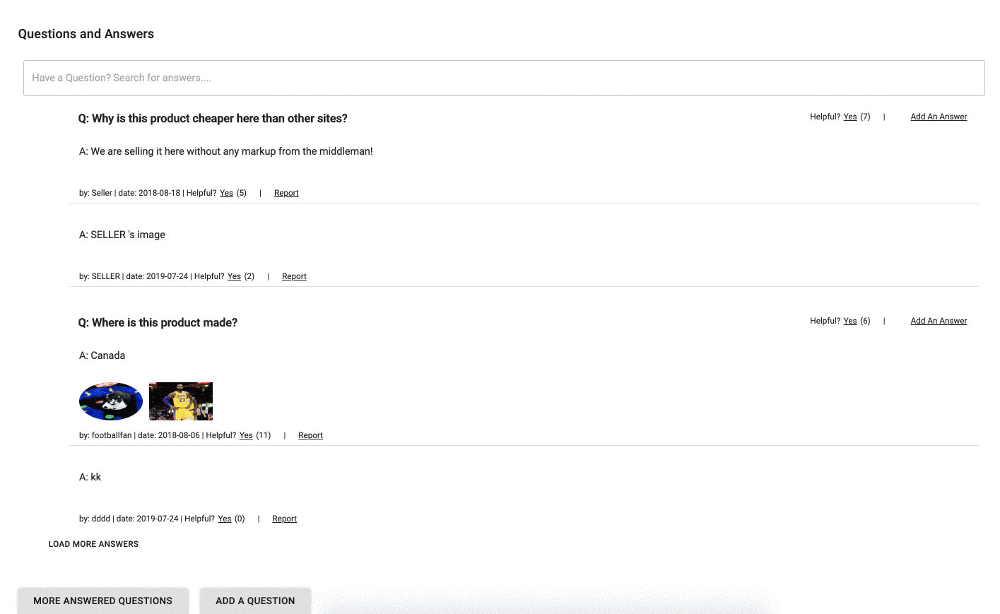
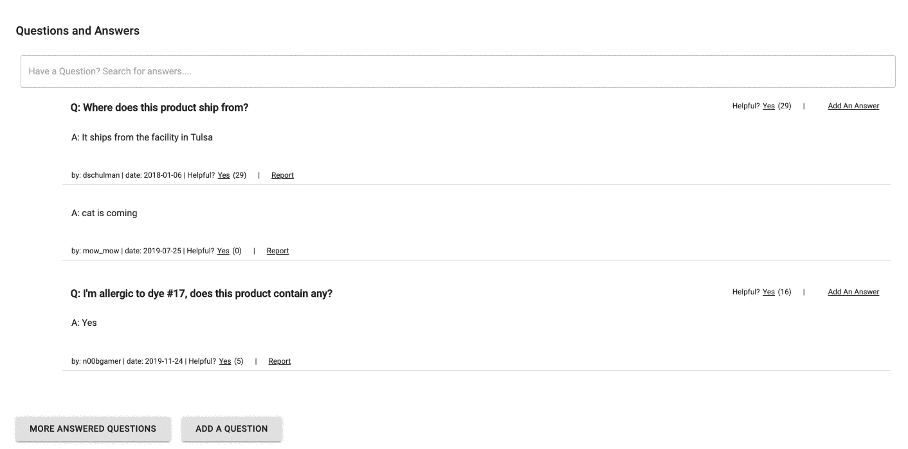

# project-greenfield

#### A high performant, React-Redux e-commerce storefront, styled with Material-UI, rendered server-side

## To build:
### For development:
```
npm run dev_build
```

### For production:
```
npm run production_build
```
## To start:
```
npm start
```
## To view:
Go to **localhost:8866/?products=:product_id**, where the product_id is the id of the product you would like to view.

**Please note:** simply navigating to *localhost:8866* will result in a 400 error. There is no homepage, there are only product pages.

## Product Overview

* Main image display allows the user to scroll through the current product, view as expanded, and zoom in if needed.  Thumbnails overlay the main image, the current thumbnail is highlighted.  If there are more thumbnails, arrows will be displayed allowing the user to cycle through.  The user is able to click on any thumbnail and go to that image.


* A user is able to select different styles under the current product.  If that style is on sale, the new price will be shown in red.  The available quantity is dictated by which size is selected.



## Related Products

* Users can view the headline information and thumbnail photo of various related products; compare the characteristics of the current product to any related product; and navigate to related product pages.



## Outfits

* Users can add the current product to their outfits and can remove any items from their outfits in the outfits widget. Outfits persist for the user across sessions.



## Questions & Answers
* Users can render, both, more questions and answers on click, then collapse the page whenever needed. 

<br/>



<br/>
<br/>

* Users can search for questions and filter out just to the specific question/questions they are looking for. 



